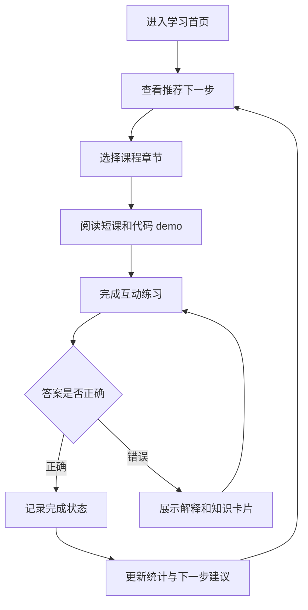

## 1. 产品概述
Rust 阶梯学习站是一个完全用 Rust 技术栈实现的渐进式学习网站，帮助反复入门但难以形成体系的用户通过短课、做题和小 demo 逐步掌握 Rust。
- 主要解决语法点零散、所有权/借用难以消化、学习缺少即时反馈的问题。
- 目标是提供一个可部署到 Cloudflare 的轻量学习产品，先覆盖核心语法闭环，再通过题库扩展持续加深。

## 2. 核心功能

### 2.1 用户角色
| 角色 | 注册方式 | 核心权限 |
|------|----------|----------|
| 学习者 | 无需注册，本地浏览器保存进度 | 浏览学习路径、完成练习、查看解释、继续上次进度 |

### 2.2 功能模块
1. **学习首页**：产品主张、当前学习进度、推荐下一步、核心章节入口。
2. **课程路径页**：按 Rust 学习阶段展示章节、知识点、完成状态和难度。
3. **互动练习页**：单选题、填空题、代码阅读题、排序题和小 demo 引导。
4. **知识卡片页**：将所有权、借用、生命周期、错误处理等难点拆成可复习卡片。
5. **学习统计页**：展示完成率、正确率、薄弱章节和连续学习记录。

### 2.3 页面详情
| 页面名称 | 模块名称 | 功能描述 |
|----------|----------|----------|
| 学习首页 | Hero 与学习状态 | 展示“下一题/下一课”入口、总进度、今日建议任务 |
| 学习首页 | 概念路线 | 用阶段化卡片呈现从变量到 async 的学习顺序 |
| 课程路径页 | 章节列表 | 展示章节标题、目标、预计耗时、完成状态 |
| 课程路径页 | 章节详情 | 展示本章知识点、关键示例和推荐练习 |
| 互动练习页 | 题目引擎 | 支持单选、填空、代码输出判断、步骤排序 |
| 互动练习页 | 即时反馈 | 提交后展示正确性、解释、下一步建议 |
| 互动练习页 | 小 demo | 展示可读代码片段、运行结果说明和关键语法标注 |
| 知识卡片页 | 概念复习 | 按标签和难度筛选概念卡片 |
| 学习统计页 | 进度看板 | 从本地存储读取完成记录，展示章节进度和正确率 |

## 3. 核心流程
学习者进入网站后，先看到当前阶段和下一步建议；选择章节后阅读短内容，再进入互动练习。每道题提交后立即给出解释，正确则推进进度，错误则推荐对应知识卡片。所有进度保存在浏览器本地，部署版本无需登录即可使用。

## 4. 用户界面设计

### 4.1 设计风格
- 主色：深墨黑 `#07110f`，辅助色：雾面薄荷 `#75f6c8`，强调色：琥珀 `#f5b85b`。
- 按钮：胶囊形主按钮，轻微内发光，悬浮时出现细线扫描动画。
- 字体：优先使用本地系统等宽字体表达代码感，标题使用更紧凑的 display 风格；数字使用 `tabular-nums`。
- 布局：桌面优先，左侧学习路径，右侧沉浸式题目与解释面板，避免密集卡片堆叠。
- 图标：使用纯 CSS/Rust 渲染的符号和状态点，不依赖外部图片资源。

### 4.2 页面设计概览
| 页面名称 | 模块名称 | UI 元素 |
|----------|----------|---------|
| 学习首页 | Hero 与学习状态 | 大标题、进度环、推荐任务胶囊、低对比网格背景 |
| 课程路径页 | 章节列表 | 阶梯式路线、完成状态点、难度标签、章节摘要 |
| 互动练习页 | 题目引擎 | 代码块、选项按钮、填空输入、提交按钮、解释抽屉 |
| 知识卡片页 | 概念复习 | 标签筛选、概念卡片、错误示例和修正示例 |
| 学习统计页 | 进度看板 | 完成率、正确率、薄弱章节、学习 streak |

### 4.3 响应式
桌面优先实现，宽屏使用双栏学习工作台；平板收敛为上下结构；移动端保留核心做题流程，章节导航折叠为顶部胶囊组。所有交互目标尺寸不小于 44px。

### 4.4 范围边界
- 首版不做用户登录、云端同步、排行榜和社区功能。
- 首版不执行用户任意 Rust 代码，避免浏览器或边缘运行时沙箱风险；题目采用预置答案、规则校验和解释反馈。
- 首版部署到 Cloudflare Pages，静态 WASM 站点即可满足需求；如后续需要云端进度，再增补 Rust Cloudflare Worker API。
