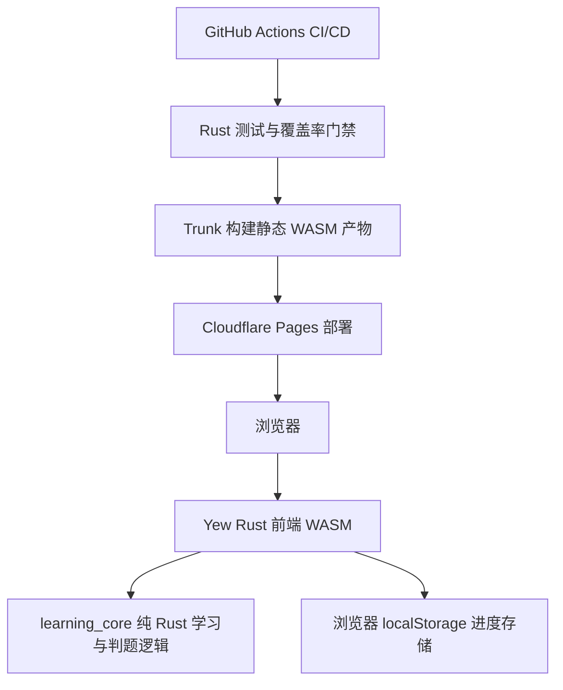

## 1. 架构设计



整体采用 Rust workspace：前端 crate 负责 Yew 组件和浏览器交互，核心学习逻辑抽到纯 Rust crate，便于在非 WASM 环境中做高覆盖单元测试。部署目标为 Cloudflare Pages，发布静态 HTML/CSS/WASM 产物。

## 2. 技术描述
- 前端：Rust + Yew `0.21` + WASM，使用 Trunk 构建。
- 核心逻辑：`learning_core` Rust library，包含课程数据、题目校验、进度计算、推荐下一步。
- 浏览器存储：通过 Rust crate `gloo-storage` 访问 `localStorage`。
- 样式：纯 CSS，随 Trunk 静态打包，不引入 JS 框架。
- 测试：`cargo test --workspace`、`cargo llvm-cov` 覆盖率门禁，目标 line coverage `>= 90%`。
- CI/CD：GitHub Actions 安装 Rust、Trunk、wasm target 和 `cargo-llvm-cov`，验证后用 `cloudflare/wrangler-action` 部署到 Cloudflare Pages。
- 初始化方式：手写 Cargo workspace，避免引入非 Rust 前端脚手架。

## 3. 路由定义
| 路由 | 用途 |
|------|------|
| `/` | 学习首页，展示进度、推荐下一步和章节入口 |
| `/learn` | 课程路径页，展示阶段化学习地图 |
| `/exercise/:id` | 互动练习页，完成题目、查看解释和 demo |
| `/cards` | 知识卡片页，复习关键语法和易错点 |
| `/stats` | 学习统计页，展示本地进度、正确率和薄弱章节 |

首版可在 Yew 内部实现轻量路由状态；Cloudflare Pages 通过 SPA fallback 支持刷新深链。

## 4. API 定义
首版无远程业务 API，所有学习与判题逻辑在 WASM 中运行。为部署和运维保留以下静态约定：

```rust
pub struct Lesson {
    pub id: &'static str,
    pub title: &'static str,
    pub stage: Stage,
    pub goals: &'static [&'static str],
    pub exercises: &'static [&'static str],
}

pub enum ExerciseKind {
    SingleChoice,
    FillBlank,
    OrderSteps,
    CodeOutput,
}

pub struct Exercise {
    pub id: &'static str,
    pub lesson_id: &'static str,
    pub prompt: &'static str,
    pub kind: ExerciseKind,
    pub answer: Answer,
    pub explanation: &'static str,
}

pub struct ProgressSnapshot {
    pub completed_exercises: Vec<String>,
    pub attempts: Vec<AttemptRecord>,
}
```

## 5. 服务端架构图
首版不需要自建服务端。部署链路如下：


## 6. 数据模型

### 6.1 数据模型定义

```mermaid
erDiagram
  LESSON ||--o{ EXERCISE : "包含"
  LESSON {
    string id
    string title
    string stage
    string goals
  }
  EXERCISE {
    string id
    string lesson_id
    string kind
    string prompt
    string answer
    string explanation
  }
  PROGRESS ||--o{ ATTEMPT : "记录"
  PROGRESS {
    string storage_key
    string completed_exercises
  }
  ATTEMPT {
    string exercise_id
    bool correct
    number timestamp
  }
```



### 6.2 本地存储结构
不使用数据库，浏览器 `localStorage` 保存 JSON：

```json
{
  "version": 1,
  "completed_exercises": ["ownership-q1", "borrow-q1"],
  "attempts": [
    {
      "exercise_id": "ownership-q1",
      "correct": true,
      "timestamp": 1782129600
    }
  ]
}
```

## 7. 代码结构规划
```text
.
├── Cargo.toml
├── crates
│   └── learning_core
│       ├── Cargo.toml
│       └── src
│           ├── lib.rs
│           ├── curriculum.rs
│           ├── exercises.rs
│           └── progress.rs
├── apps
│   └── web
│       ├── Cargo.toml
│       ├── Trunk.toml
│       ├── index.html
│       ├── styles.css
│       └── src
│           ├── main.rs
│           ├── app.rs
│           └── components.rs
└── .github
    └── workflows
        └── ci-cd.yml
```

## 8. CI/CD 工作流
1. `cargo fmt --all -- --check`
2. `cargo clippy --workspace --all-targets -- -D warnings`
3. `cargo test --workspace`
4. `cargo llvm-cov --workspace --fail-under-lines 90`
5. `rustup target add wasm32-unknown-unknown`
6. `cargo install trunk --locked`
7. `trunk build --release apps/web/index.html --dist dist`
8. `wrangler pages deploy dist --project-name <Cloudflare Pages 项目名>`

GitHub Actions 需要配置以下 secrets：
- `CLOUDFLARE_API_TOKEN`
- `CLOUDFLARE_ACCOUNT_ID`
- `CLOUDFLARE_PAGES_PROJECT`

## 9. 风险与取舍
- 在线执行任意 Rust 代码需要安全沙箱，首版不实现；改用规则判题和可解释 demo，先保证学习闭环。
- 纯 WASM 前端可部署成本低、响应快，但跨设备进度同步需要后续增加 Worker + KV/D1。
- 测试覆盖率主要落在 `learning_core`，Yew 组件以编译校验和少量状态逻辑测试为主，避免为 UI 快照引入过重依赖。
